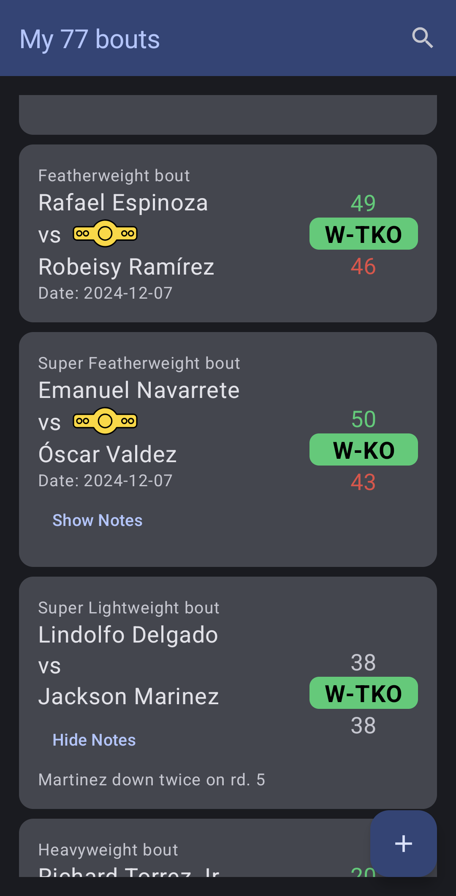

# BoutScoring

**BoutScoring** is an Android app designed to score combat sports bouts using the 10-point scoring system. The app provides a user-friendly interface to manage and score bouts effectively.

## Features

1. **Add Bouts**: Quickly create new bouts with customizable details.
2. **Delete Bouts**: Remove bouts by long-pressing on them in the list.
3. **Score Rounds**: Tap on the winning corner to assign points and adjust scores by tapping individual numbers to decrement.
4. **Edit Bout Information**: Update bout details such as:
    - Winner
    - Result method
    - Weight class
    - Championship status
    - Location
    - Date
    - Notes for additional context
5. **Dark and light mode** (according to system preference)

## Screenshots

### Bout List

### Add New Bout

### Score a Bout

### Edit Bout Information

## How to Use

1. Use the **Add** button to create a new bout.
2. Select a bout from the list to view and edit details.
3. Score rounds by tapping the corners or decrementing individual scores as needed.
4. Long-press a bout in the list to delete it.

## Requirements

- Android 13 (API Level 33) or higher.

## License

[MIT License](/LICENSE)
